# HTML CSS JavaScript Projects

A collection of small **frontend projects** built using **HTML, CSS, and JavaScript**.  
Each project focuses on a **single concept** to strengthen core web fundamentals.

---

## 📁 Projects Overview

### 🧊 3d-image-effect

3D hover effect on images using **Pixi.js**.

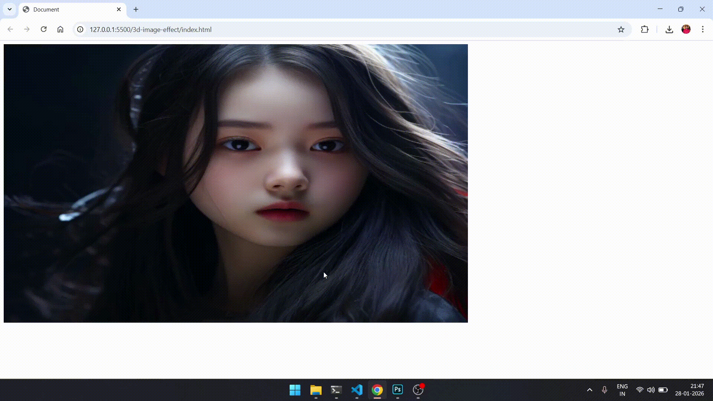

---

### 🎂 age-calculator

Calculate age from date of birth to current date using JavaScript date logic.

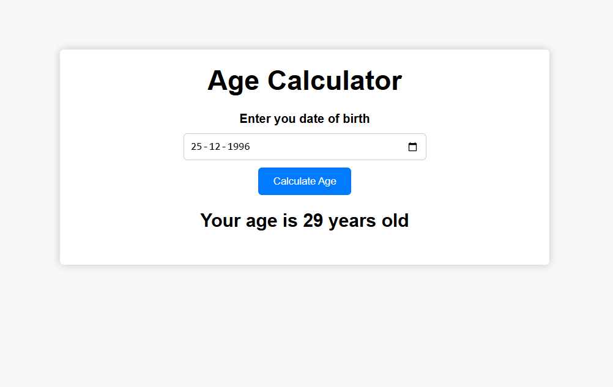

---

### 🖼️ background-slider

Image slider with **background blur transition**.

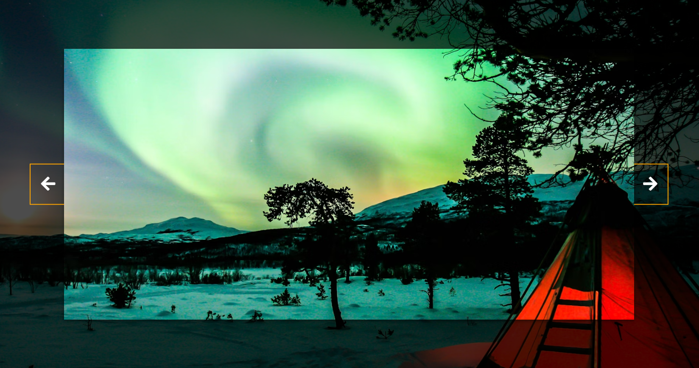

---

### ➕ basic-calculator

Simple web calculator using JavaScript events and logic.

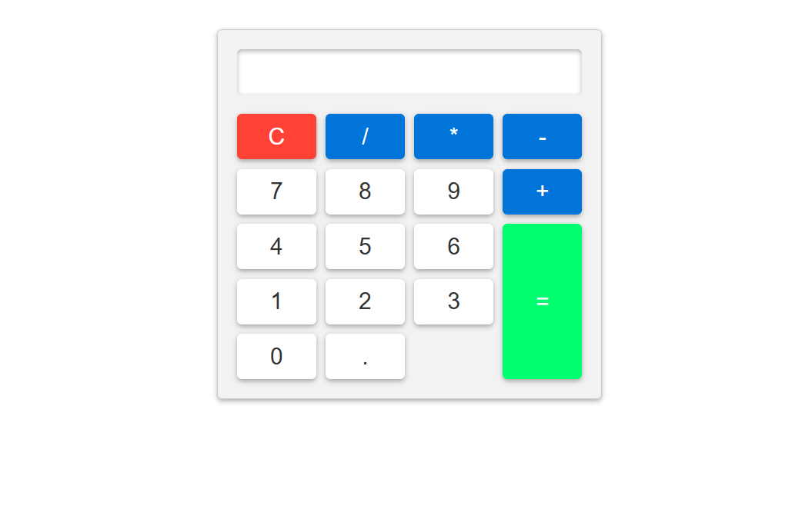

---

### 🧱 basic-html-css-js

Basic demonstration of **HTML, CSS, and JavaScript** usage.

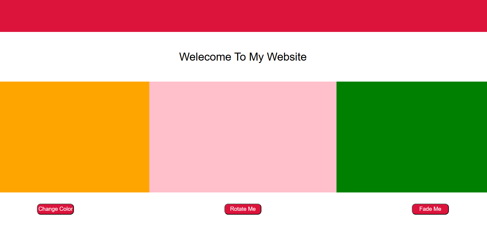

---

### ❄️ html-css-snowfall

Snowfall animation using **HTML & CSS only**.

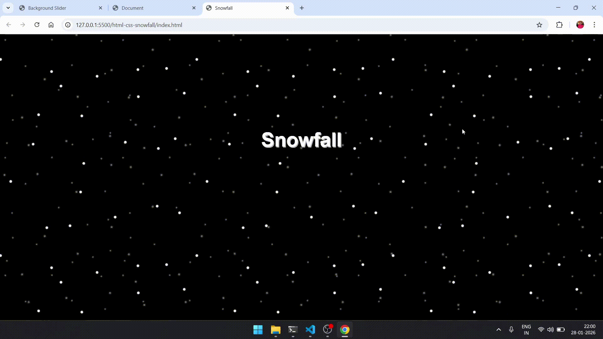

---

### 🔣 pattern-generator

Generate patterns using emojis and user-defined size.

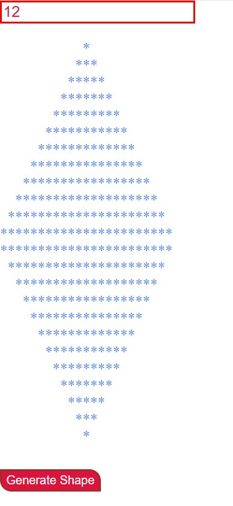

---

### 🥧 pieInteractivity

Animated pie chart with percentage updates.

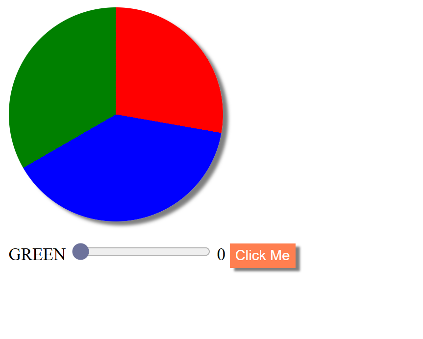

---

### 🌐 program-to-fetch-image

Fetch images from different APIs using **async JavaScript**.

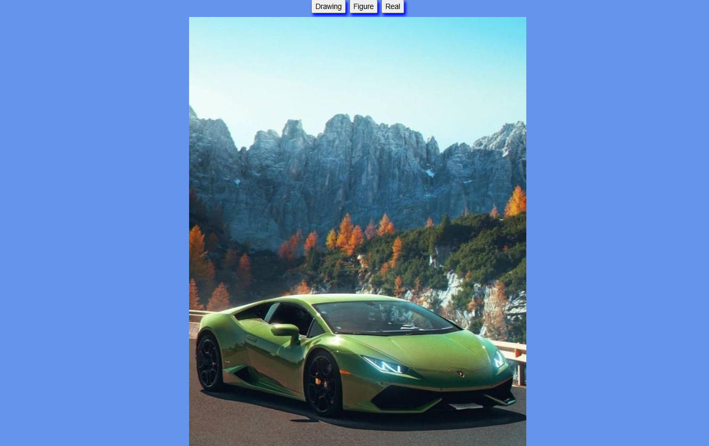

---

### 🏦 simple-bank

Basic bank account simulation using JavaScript state.

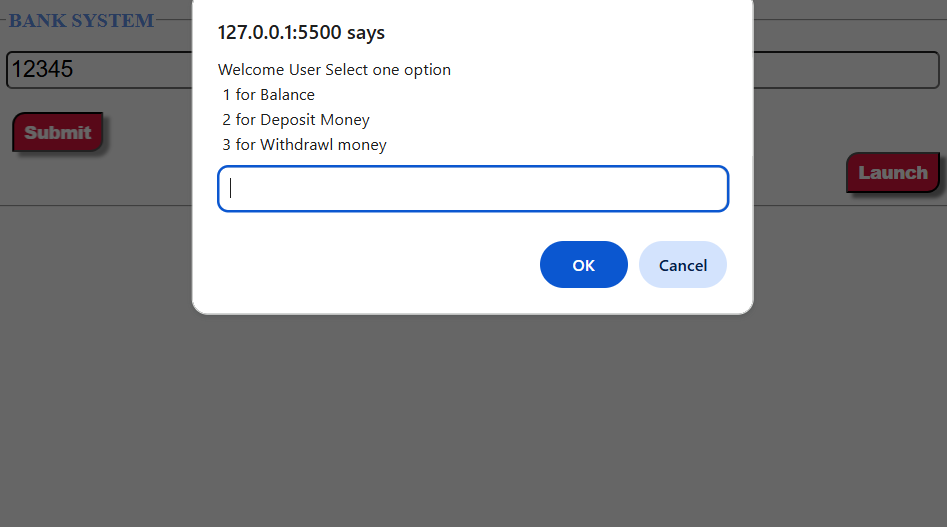

---

### ⏳ simple-css-json-loader

Loading animation using **CSS and JSON**.

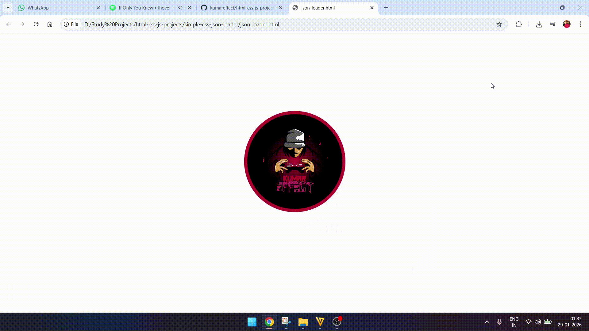

---

### 🎵 singer-song-table

Table showing singers and their songs using HTML & JS.

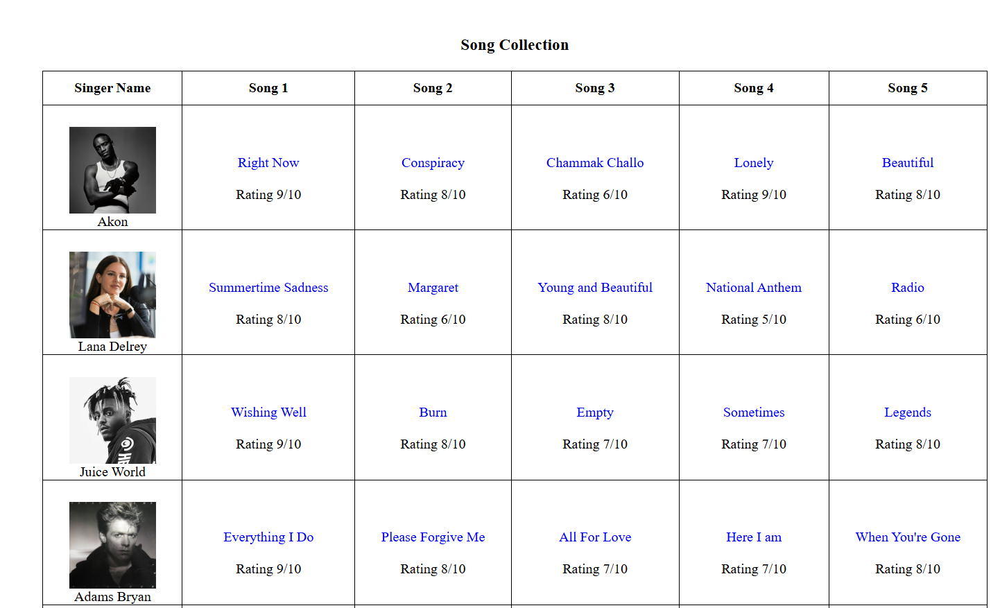

---

### ⏱️ stopwatch

Web stopwatch with start, stop, and reset functionality.

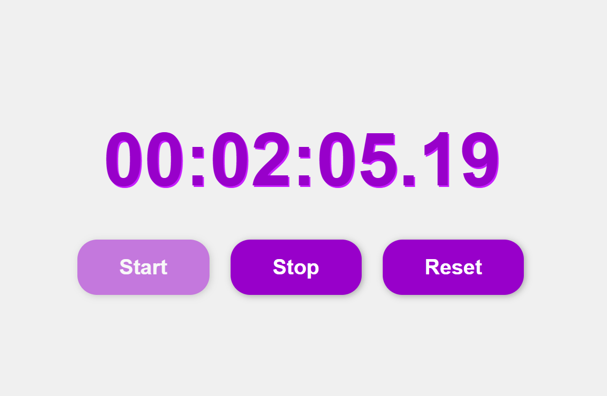

---

### 🏢 tcs-ui-clone

Frontend **UI clone of TCS website** (practice purpose only).

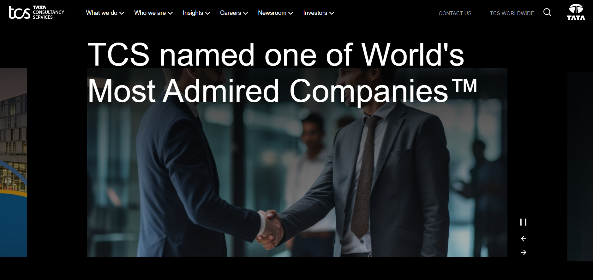

---

### 📍 wayfy-map

A map-based project to mark yourself on the map.

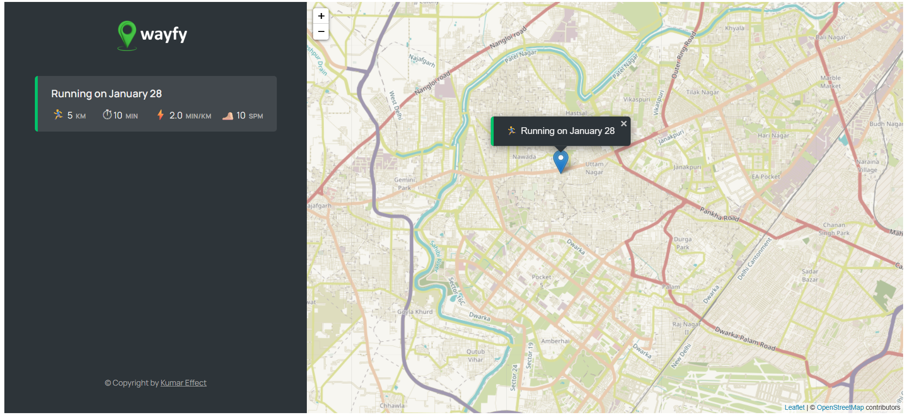

---

## 🧠 Purpose of this Repository

- Practice **core frontend concepts**
- Build logic without frameworks
- Improve **JavaScript fundamentals**
- Prepare for interviews

---

## 🚀 Tech Stack

- HTML
- CSS
- JavaScript

---

⭐ If you find this useful, feel free to star the repository.
